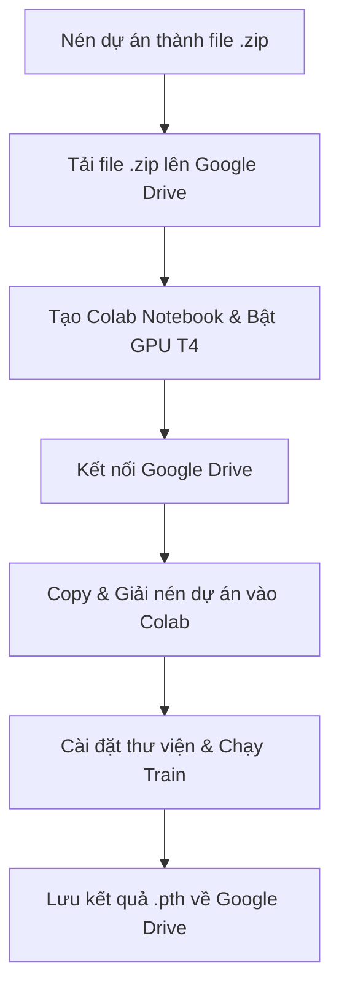

# Hướng dẫn Huấn luyện Mô hình trên Google Colab

Tài liệu này hướng dẫn chi tiết cách cấu hình và chạy huấn luyện mô hình Object Detection tùy chỉnh từ mã nguồn dự án này trên Google Colab nhằm tận dụng GPU miễn phí (T4 GPU).

---

## Quy trình tóm tắt


---

## Hướng dẫn chi tiết từng bước

### Bước 1: Chuẩn bị mã nguồn và dữ liệu
Nén toàn bộ thư mục dự án này (`final`) thành một tệp `.zip` (ví dụ: `final.zip`). Cấu trúc file zip khi giải nén ra phải chứa trực tiếp các thư mục và tệp sau ở cấp cao nhất:
```text
final.zip/
├── models/
├── utils/
├── data/
│   └── public/
│       ├── annotations/ (chứa train.json, val.json)
│       ├── train/images
│       └── val/images
├── train.py
├── requirements.txt
...
```

Sau đó, tải tệp `final.zip` này lên **Google Drive** của bạn (khuyên dùng: tạo một thư mục tên là `Colab_Project` trên Drive và upload tệp zip vào đó).

---

### Bước 2: Tạo và Cấu hình Google Colab
1. Truy cập [Google Colab](https://colab.research.google.com/) và tạo một Notebook mới.
2. Đổi tên Notebook thành `train_object_detection.ipynb` (tùy chọn).
3. Kích hoạt GPU: Vào menu **Runtime** (Thời gian chạy) -> **Change runtime type** (Thay đổi loại thời gian chạy) -> chọn **T4 GPU** (hoặc GPU mạnh hơn nếu có Colab Pro) -> Nhấn **Save** (Lưu).

---

### Bước 3: Kết nối với Google Drive
Tạo một ô mã nguồn (Code cell) mới trong Colab, dán đoạn mã sau vào và chạy để liên kết Colab với tài khoản Google Drive chứa file zip:

```python
from google.colab import drive
drive.mount('/content/drive')
```
*Hệ thống sẽ hiển thị yêu cầu cấp quyền truy cập Drive, bạn hãy nhấn đồng ý.*

---

### Bước 4: Giải nén mã nguồn vào môi trường cục bộ của Colab
> [!TIP]
> **Tối ưu hóa Tốc độ (Crucial Tip):** Tránh chạy huấn luyện trực tiếp trên thư mục Google Drive (`/content/drive/MyDrive/...`) vì tốc độ đọc/ghi (I/O) qua Drive rất chậm. Việc copy file nén vào ổ đĩa ảo của Colab (`/content/`) rồi mới giải nén sẽ giúp quá trình đọc ảnh nhanh hơn gấp nhiều lần và không bị nghẽn GPU.

Chạy đoạn mã sau để thiết lập thư mục làm việc và giải nén:

```bash
# 1. Tạo thư mục làm việc cục bộ trên Colab
!mkdir -p /content/project

# 2. Copy file zip từ Google Drive vào thư mục vừa tạo
# (Hãy điều chỉnh đường dẫn nếu bạn lưu tên file hoặc thư mục trên Drive khác)
!cp "/content/drive/MyDrive/Colab_Project/final.zip" /content/project/

# 3. Di chuyển vào thư mục dự án và giải nén
%cd /content/project
!unzip -q final.zip

# 4. Kiểm tra cấu trúc thư mục sau khi giải nén
!ls -la
```

---

### Bước 5: Cài đặt Thư viện Phụ thuộc (Dependencies)
Cài đặt các thư viện cần thiết bằng lệnh:

```bash
# Nâng cấp pip và cài đặt các thư viện trong requirements.txt
!pip install -r requirements.txt
```

---

### Bước 6: Chạy Huấn luyện (Training)
Chạy tập lệnh `train.py` với các tham số tương tự như chạy cục bộ. Bạn có thể tăng `batch_size` lên `16` hoặc `32` (do GPU T4 có 16GB VRAM) và tăng `num_workers` lên `2` để đẩy nhanh tiến độ tải dữ liệu.
```bash
python train.py \
  --train_data data/pascal/annotations/train.json \
  --val_data data/pascal/annotations/val.json \
  --image_dir data/pascal/images \
  --val_image_dir data/pascal/images \
  --checkpoint_dir checkpoints/pascal \
  --epochs 100 \
  --batch_size 16 \
  --num_workers 2
```

```bash
python train.py \
  --train_data data/public/annotations/train.json \
  --val_data data/public/annotations/val.json \
  --image_dir data/public/train/images \
  --val_image_dir data/public/val/images \
  --checkpoint_dir models/ \
  --epochs 30 \
  --batch_size 16 \
  --num_workers 2
```

---

### Bước 7: Backup Trọng số (Weights) về Google Drive
> [!WARNING]
> **Chú ý quan trọng:** Sau khi phiên làm việc trên Colab kết thúc (hoặc bị ngắt kết nối do chạy quá lâu), tất cả dữ liệu trên ổ đĩa ảo `/content/` sẽ bị xóa sạch. Do đó, bạn cần sao lưu các tệp trọng số đã huấn luyện về Google Drive để sử dụng cho việc suy luận (inference) sau này.

Chạy lệnh sau để sao lưu thư mục `models` (chứa các file `.pth` tốt nhất và cuối cùng) về Drive:

```bash
# Tạo thư mục lưu trữ weights trên Google Drive
!mkdir -p "/content/drive/MyDrive/Colab_Project/checkpoints/"

# Copy toàn bộ trọng số huấn luyện về Drive
!cp -r models/* "/content/drive/MyDrive/Colab_Project/checkpoints/"

# Kiểm tra xem các file đã được sao lưu thành công chưa
!ls -la "/content/drive/MyDrive/Colab_Project/checkpoints/"
```

Bây giờ các tệp trọng số quan trọng như `best.pth`, `best_loss.pth` và `last.pth` đã nằm an toàn trên Google Drive của bạn!
