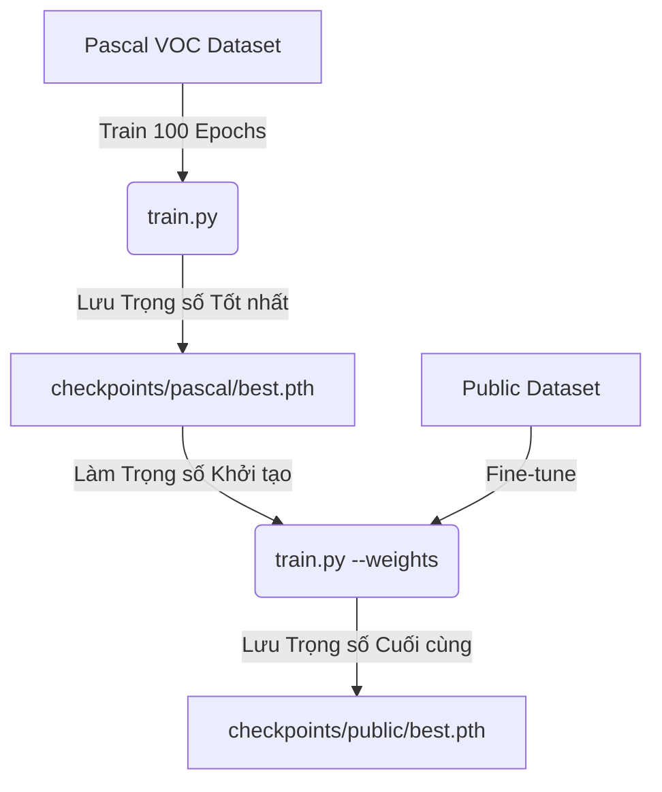

# Hướng dẫn Huấn luyện Liên tục (Transfer Learning) trên Lightning AI Studio

Tài liệu này hướng dẫn chi tiết cách thực hiện huấn luyện mô hình Object Detection qua 2 giai đoạn trên **Lightning AI Studio**:
1. **Giai đoạn 1 (Pre-training):** Huấn luyện mô hình từ đầu (from scratch) trên tập dữ liệu lớn **Pascal VOC** (100 epochs, có Early Stopping) để mô hình học được các đặc trưng chung của 5 lớp đối tượng (`person`, `car`, `dog`, `cat`, `chair`).
2. **Giai đoạn 2 (Fine-tuning):** Sử dụng trọng số tốt nhất (`best.pth`) từ Giai đoạn 1 làm điểm khởi đầu để tiếp tục huấn luyện tinh chỉnh trên tập dữ liệu mục tiêu **Public**.

---

## Quy trình Huấn luyện


---

## Các bước thực hiện chi tiết

### Giai đoạn 1: Huấn luyện trên tập dữ liệu Pascal VOC (Pre-training)

Chạy lệnh train trên tập dữ liệu Pascal VOC với số epoch là 100. Tập lệnh sẽ tự động áp dụng Early Stopping (mặc định dừng sau 20 epoch nếu loss không giảm) và lưu lại mô hình tốt nhất vào thư mục `checkpoints/pascal/`.

**Lệnh chạy:**
```bash
python train.py \
  --train_data data/pascal/annotations/train.json \
  --val_data data/pascal/annotations/val.json \
  --image_dir data/pascal/images \
  --val_image_dir data/pascal/images \
  --checkpoint_dir checkpoints/pascal \
  --epochs 100 \
  --batch_size 16 \
  --num_workers 2
```

> [!NOTE]
> * **Đầu ra mong muốn:** Sau khi kết thúc hoặc dừng sớm, file trọng số tốt nhất sẽ được lưu tại: `checkpoints/pascal/best.pth` (tối ưu theo mAP) hoặc `checkpoints/pascal/best_loss.pth` (tối ưu theo Loss).
> * **CUDA GPU:** Lệnh trên sẽ tự động phát hiện và chạy trên GPU của Studio nếu có.

---

## Quyết định sau khi hoàn thành Giai đoạn 1

Sau khi kết thúc Giai đoạn 1 (Pascal VOC), bạn có 2 lựa chọn:

### Lựa chọn A: DỪNG LẠI (Stop)
Nếu bạn đã hài lòng với mô hình huấn luyện trên Pascal VOC hoặc không muốn huấn luyện thêm:
* Bạn đã hoàn tất quá trình huấn luyện.
* Trọng số mô hình tốt nhất đã được lưu tại: `checkpoints/pascal/best.pth` (tối ưu theo mAP) hoặc `checkpoints/pascal/best_loss.pth` (tối ưu theo Loss).

---

### Lựa chọn B: TIẾP TỤC HUẤN LUYỆN (Fine-tuning trên tập Public)
Nếu bạn muốn chuyển giao tri thức từ tập dữ liệu lớn Pascal VOC sang tập dữ liệu Public của mình để tối ưu hóa mAP:

1. **Sử dụng trọng số tốt nhất:** Truyền file checkpoint tốt nhất vừa lưu được ở Giai đoạn 1 thông qua tham số `--weights checkpoints/pascal/best.pth`.
2. **Khởi tạo lại tốc độ học (Reset Learning Rate):** Vì tập Public nhỏ hơn Pascal VOC, ta cần giảm tốc độ học xuống thấp hơn mức mặc định `1e-3` (ví dụ sử dụng `--lr 5e-4` hoặc `--lr 2e-4`) để tinh chỉnh nhẹ nhàng các trọng số, tránh làm phá vỡ các đặc trưng quan trọng mà mô hình đã học trước đó.

**Lệnh chạy Fine-tuning:**
```bash
python train.py \
  --train_data data/public/annotations/train.json \
  --val_data data/public/annotations/val.json \
  --image_dir data/public/images \
  --val_image_dir data/public/images \
  --checkpoint_dir checkpoints/public \
  --weights checkpoints/pascal/best.pth \
  --epochs 30 \
  --batch_size 16 \
  --num_workers 2 \
  --lr 5e-4
```

*Trong đó:*
* `--weights checkpoints/pascal/best.pth`: Dùng trọng số tốt nhất từ Giai đoạn 1 làm điểm bắt đầu.
* `--lr 5e-4`: Tốc độ học được reset thấp hơn (5e-4) để tinh chỉnh mô hình mượt mà trên tập dữ liệu mới.
* `--checkpoint_dir checkpoints/public`: Nơi lưu các trọng số sau khi hoàn thành tinh chỉnh.

---

### Bước 3: Đánh giá và Dự đoán (Inference)

Sau khi tinh chỉnh xong, bạn có thể chạy thử file suy luận `predict.py` để kiểm tra độ chính xác trực quan của mô hình đã fine-tune trên các hình ảnh thực tế của tập `public`:

```bash
python predict.py \
  --weights checkpoints/public/best.pth \
  --image_dir data/public/images \
  --output_dir predictions \
  --conf_thres 0.05
```
Các hình ảnh được vẽ bounding box dự đoán sẽ được xuất ra trong thư mục `predictions/`.
