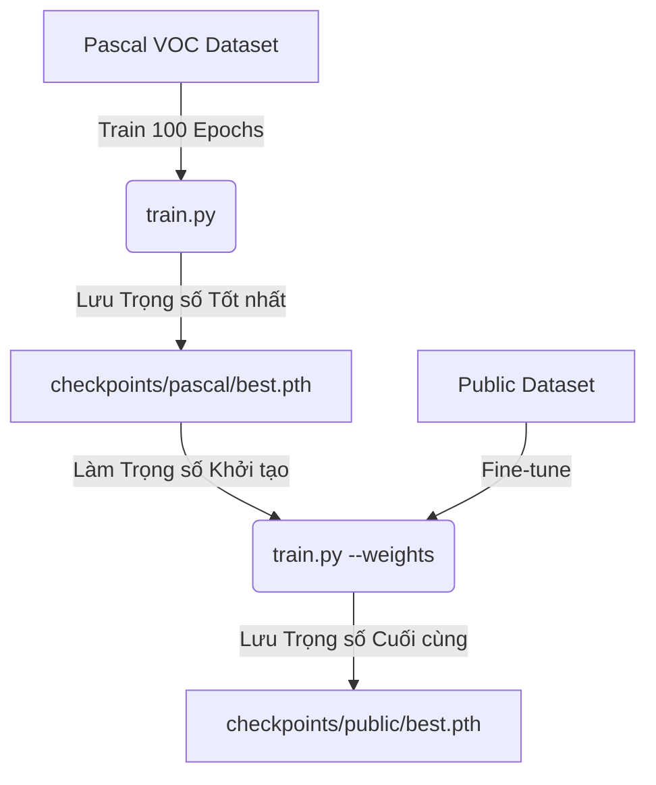

# Hướng dẫn Huấn luyện Liên tục (Transfer Learning) trên Lightning AI Studio

Tài liệu này hướng dẫn chi tiết cách thực hiện huấn luyện mô hình Object Detection qua 2 giai đoạn trên **Lightning AI Studio**:
1. **Giai đoạn 1 (Pre-training):** Huấn luyện mô hình từ đầu (from scratch) trên tập dữ liệu lớn **Pascal VOC** (100 epochs, có Early Stopping) để mô hình học được các đặc trưng chung của 5 lớp đối tượng (`person`, `car`, `dog`, `cat`, `chair`).
2. **Giai đoạn 2 (Fine-tuning):** Sử dụng trọng số tốt nhất (`best.pth`) từ Giai đoạn 1 làm điểm khởi đầu để tiếp tục huấn luyện tinh chỉnh trên tập dữ liệu mục tiêu **Public**.

---

## Quy trình Huấn luyện


---

## Các bước thực hiện chi tiết

### Giai đoạn 1: Huấn luyện trên tập dữ liệu Pascal VOC (Pre-training)

Chạy lệnh train trên tập dữ liệu Pascal VOC với số epoch là 100. Tập lệnh sẽ tự động áp dụng Early Stopping (mặc định dừng sau 20 epoch nếu loss không giảm) và lưu lại mô hình tốt nhất vào thư mục `checkpoints/pascal/`.

**Lệnh chạy:**
```bash
python train.py \
  --train_data data/pascal/annotations/train.json \
  --val_data data/pascal/annotations/val.json \
  --image_dir data/pascal/images \
  --val_image_dir data/pascal/images \
  --checkpoint_dir checkpoints/pascal \
  --epochs 100 \
  --batch_size 16 \
  --num_workers 2
```

> [!NOTE]
> * **Đầu ra mong muốn:** Sau khi kết thúc hoặc dừng sớm, file trọng số tốt nhất sẽ được lưu tại: `checkpoints/pascal/best.pth` (tối ưu theo mAP) hoặc `checkpoints/pascal/best_loss.pth` (tối ưu theo Loss).
> * **CUDA GPU:** Lệnh trên sẽ tự động phát hiện và chạy trên GPU của Studio nếu có.

---

### Giai đoạn 2: Tinh chỉnh trên tập dữ liệu Public (Fine-tuning)

Sau khi có file trọng số `best.pth` từ Giai đoạn 1, chúng ta sẽ nạp nó vào mô hình bằng tham số `--weights` mới được cập nhật để bắt đầu huấn luyện tinh chỉnh (Fine-tuning) trên tập dữ liệu `public`.

> [!TIP]
> **Mẹo Tối ưu Tinh chỉnh (Fine-tuning Tip):** 
> Khi fine-tune trên tập dữ liệu mới nhỏ hơn, ta nên giảm tốc độ học xuống một chút (ví dụ dùng `--lr 5e-4` hoặc `--lr 2e-4` thay vì `1e-3` mặc định) để tránh làm "vỡ" các đặc trưng quan trọng mà mô hình đã học được ở giai đoạn trước từ tập Pascal VOC.

**Lệnh chạy:**
```bash
python train.py \
  --train_data data/public/annotations/train.json \
  --val_data data/public/annotations/val.json \
  --image_dir data/public/images \
  --val_image_dir data/public/images \
  --checkpoint_dir checkpoints/public \
  --weights checkpoints/pascal/best.pth \
  --epochs 30 \
  --batch_size 16 \
  --num_workers 2 \
  --lr 5e-4
```

*Trong đó:*
* `--weights checkpoints/pascal/best.pth`: Chỉ định file trọng số tốt nhất đã học từ tập Pascal làm điểm bắt đầu.
* `--checkpoint_dir checkpoints/public`: Chỉ định thư mục lưu trọng số sau khi tinh chỉnh trên tập Public.
* `--lr 5e-4`: Tốc độ học nhỏ hơn một chút để giữ lại bộ đặc trưng tốt từ tập dữ liệu lớn.

---

### Bước 3: Đánh giá và Dự đoán (Inference)

Sau khi tinh chỉnh xong, bạn có thể chạy thử file suy luận `predict.py` để kiểm tra độ chính xác trực quan của mô hình đã fine-tune trên các hình ảnh thực tế của tập `public`:

```bash
python predict.py \
  --weights checkpoints/public/best.pth \
  --image_dir data/public/images \
  --output_dir predictions \
  --conf_thres 0.05
```
Các hình ảnh được vẽ bounding box dự đoán sẽ được xuất ra trong thư mục `predictions/`.
