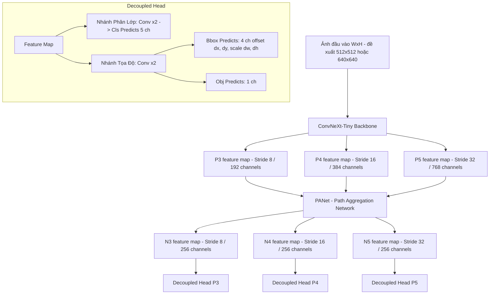

# Kế hoạch triển khai mô hình Object Detection từ đầu đạt mAP cao nhất (Không dùng Anchor - Huấn luyện trên GPU T4)

Đề xuất phương pháp xây dựng mô hình Object Detection tùy chỉnh từ đầu (không sử dụng YOLOv5/v8, Detectron2, torchvision detection APIs) sử dụng backbone **ConvNeXt-Tiny** kết hợp với **PANet (Path Aggregation Network)** và **Decoupled Head (YOLOX-style)** hoạt động theo cơ chế **không dùng neo (Anchor-free)**, định hướng huấn luyện trên **GPU T4 (16GB VRAM)** của bên thứ ba (Colab/Kaggle).

---

## 1. Thiết kế Kiến trúc Mô hình (Model Architecture)

Với GPU T4 (16GB VRAM), chúng ta có thể nâng cao dung lượng mạng và kích thước ảnh đầu vào để tối đa hóa mAP mà không lo ngại vấn đề tràn bộ nhớ (OOM).



### 1.1 Backbone: ConvNeXt-Tiny
- Sử dụng pre-trained weights của `convnext_tiny` từ `torchvision.models`.
- Trích xuất đặc trưng tại 3 mức phân giải:
  - **P3** (Stride 8): kích thước $\frac{W}{8} \times \frac{H}{8}$, số kênh $192$.
  - **P4** (Stride 16): kích thước $\frac{W}{16} \times \frac{H}{16}$, số kênh $384$.
  - **P5** (Stride 32): kích thước $\frac{W}{32} \times \frac{H}{32}$, số kênh $768$.

### 1.2 Neck: PANet (Path Aggregation Network)
- **Tăng số kênh từ 128 lên 256**: Việc tăng số kênh đặc trưng của Neck lên $256$ giúp giữ lại lượng lớn thông tin ngữ nghĩa và không gian, cải thiện rõ rệt khả năng biểu diễn của mô hình.

### 1.3 Head: Decoupled Head (Anchor-free YOLOX-style)
- Mỗi vị trí trên lưới đặc trưng dự đoán:
  - **Classification branch**: 2 lớp Conv -> dự đoán xác suất 5 lớp đối tượng (`person`, `car`, `dog`, `cat`, `chair`).
  - **Regression branch**: 2 lớp Conv -> dự đoán 4 kênh tọa độ ($t_x, t_y, t_w, t_h$) và 1 kênh Objectness score.
- Đầu ra của mỗi head level có số kênh là $5 + 4 + 1 = 10$.

---

## 2. Công thức Dự đoán & Gán mục tiêu (Prediction & Target Assignment)

### 2.1 Công thức suy luận tọa độ (Inference Coordinate Mapping)
Với mỗi grid cell tại vị trí dòng $row$, cột $col$ ở mức stride $s$:
- Tọa độ tâm hộp bao dự đoán ($x_{pred}, y_{pred}$):
  $$x_{pred} = (col + \sigma(t_x)) \times s$$
  $$y_{pred} = (row + \sigma(t_y)) \times s$$
- Chiều rộng và chiều cao dự đoán ($w_{pred}, h_{pred}$):
  $$w_{pred} = e^{t_w} \times s$$
  $$h_{pred} = e^{t_h} \times s$$
- Tọa độ bounding box cuối cùng được đưa về dạng $[x_{min}, y_{min}, x_{max}, y_{max}]$.

### 2.2 Quy trình Gán mục tiêu không neo (Anchor-free Target Assignment)
Áp dụng cơ chế gán mẫu dựa trên khoảng cách tâm (Center-sampling):
- **Phân chia theo kích thước đối tượng (Scale Assignment)**:
  - Đối tượng nhỏ (diện tích $< 64^2$): gán cho feature map P3 (stride 8).
  - Đối tượng trung bình ($64^2 \le \text{diện tích} < 192^2$): gán cho feature map P4 (stride 16).
  - Đối tượng lớn (diện tích $\ge 192^2$): gán cho feature map P5 (stride 32).
- **Gán cell dương (Positive Samples)**:
  - Với mỗi GT box, tìm grid cell chứa tâm của GT box trên feature map tương ứng được chỉ định.
  - Thiết lập vùng lân cận (radius = 1.5 cell xung quanh tâm) để gán nhãn **Positive** (Objectness target = 1.0, Class target = nhãn thực tế).
  - Các cell còn lại là **Negative** (Objectness target = 0.0).

---

## 3. Tăng cường Dữ liệu Nâng cao (Data Augmentation)

Các kỹ thuật tăng cường dữ liệu:
1. **Mosaic 4-Image**: Trộn ngẫu nhiên 4 ảnh huấn luyện thành một ảnh lớn để tăng mật độ đối tượng trên mỗi batch và đa dạng hóa kích thước vật thể.
2. **Mixup**: Kết hợp tuyến tính giữa hai ảnh bất kỳ để tăng khả năng chống quá khớp (overfitting).
3. **Albumentations**:
   - `HorizontalFlip(p=0.5)`
   - `ColorJitter(brightness=0.2, contrast=0.2, saturation=0.2, hue=0.1, p=0.5)`
   - `ShiftScaleRotate(shift_limit=0.0625, scale_limit=0.1, rotate_limit=10, border_mode=0, p=0.5)`

---

## 4. Hàm Mất Mát (Loss Function)

$$L_{total} = \lambda_{reg} L_{reg} + \lambda_{obj} L_{obj} + \lambda_{cls} L_{cls}$$

1. **Regression Loss ($L_{reg}$)**: Sử dụng **CIoU Loss** (Complete IoU Loss).
   - Tối ưu hóa trực tiếp hình dáng, tâm và diện tích chồng chập của predicted box và GT box.
2. **Objectness Loss ($L_{obj}$)**: Sử dụng **BCE Loss with Logits**.
   - Target cho các cell positive là **chỉ số IoU thực tế** giữa predicted box và GT box tương ứng. Target cho các cell negative là `0.0`.
3. **Classification Loss ($L_{cls}$)**: Sử dụng **BCE Loss with Logits**.
   - Chỉ tính toán trên các cell dương (positive cells).

---

## 5. Chiến lược Huấn luyện & Tối ưu hóa trên GPU T4 (16GB)

Việc huấn luyện trên GPU T4 cho phép cấu hình mạnh mẽ hơn:
1. **Linh hoạt thiết bị (Device Agnostic Code)**:
   - Viết code hỗ trợ tự động nhận diện thiết bị:
     ```python
     device = torch.device('cuda' if torch.cuda.is_available() else 'cpu')
     ```
   - Việc này giúp bạn chạy suy luận/kiểm thử định dạng cục bộ bằng CPU rất tiện lợi, trong khi tiến trình huấn luyện chính sẽ chạy mượt mà trên GPU T4 của bên thứ ba.
2. **Kích thước ảnh đề xuất**: Nâng lên **$512 \times 512$** hoặc **$640 \times 640$**. Kích thước ảnh lớn hơn giúp tăng khả năng nhận diện vật thể nhỏ (như `chair` hay các vật thể ở xa) và cải thiện mAP tổng thể rõ rệt.
3. **Batch Size**: Nâng lên **$16$** hoặc **$32$** để ổn định gradient và rút ngắn thời gian huấn luyện.
4. **Tối ưu hóa học tập**: Sử dụng optimizer AdamW kết hợp với Cosine Annealing scheduler và Warmup.
5. **Đánh giá mAP định kỳ**: Chạy suy luận và tính toán chỉ số mAP@0.5 bằng thư viện chính thức sau mỗi 5 epoch. Lưu tệp có mAP cao nhất thành `best.pth`.
6. **Tích hợp dừng sớm (Early Stopping):**
   - **Chỉ số theo dõi (Metric):** Độ hao hụt tập kiểm định (Validation Loss). 
     *Lý do chọn Validation Loss thay vì mAP:* Validation Loss được tính toán chính xác sau **mỗi epoch**, cho phép phát hiện sớm xu hướng bão hòa hoặc quá khớp (overfitting) với độ trễ tối thiểu (chỉ 1 epoch). Trong khi đó mAP chỉ được tính mỗi 5 epoch, nếu dùng mAP thì `patience=10` thực chất chỉ tương đương với 2 lần đánh giá mAP, không đủ độ nhạy để dừng sớm kịp thời.
   - **Tham số kiên nhẫn (Patience):** 10 epoch.
   - **Nguyên lý hoạt động:** 
     * Khởi tạo biến đếm `patience_counter = 0`.
     * Ở cuối mỗi epoch, nếu Validation Loss giảm xuống mức thấp nhất mới, ta lưu trọng số vào `best_loss.pth` và đặt `patience_counter = 0`.
     * Nếu không có cải thiện về Validation Loss, ta tăng `patience_counter += 1`.
     * Khi `patience_counter >= 10`, dừng huấn luyện sớm, thoát khỏi vòng lặp và ghi nhận epoch dừng.

---

## 6. Kế hoạch xác minh (Verification Plan)

### Kiểm thử tự động (Automated Tests)
Chạy script kiểm tra mAP trên tập validation sau khi xuất kết quả:
```powershell
python public/tools/evaluate_predictions.py --ground_truth public/annotations/val.json --predictions val_predictions.json --output val_score.json
```

### Câu hỏi mở (Open Questions)
> [!IMPORTANT]
> 1. Thiết kế tích hợp Early Stopping dựa trên **Validation Loss** được thực hiện mỗi epoch giúp tăng độ phân giải giám sát so với việc chỉ kiểm tra mAP sau mỗi 5 epoch. Bạn có đồng ý với phương án thiết kế này không?
